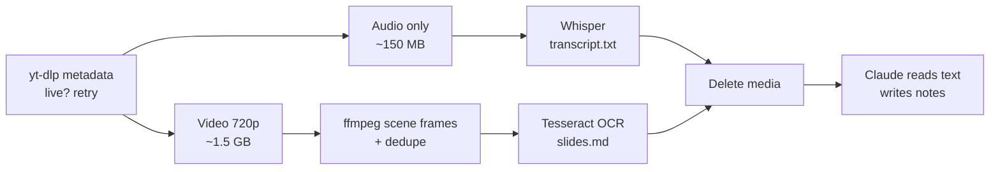

# Amazon ML Challenge 2026: Overnight Claude Code Prep Plan

2026-09-21 · @Someone

## Quick start (tonight, \~20 minutes of your time)

Install the tools in the next section, make an empty project folder, paste the master prompt into Claude Code, and go to sleep. By morning you should have transcripts, slide text, and a prep playbook in that folder, with every video file deleted.

1. Check you have at least 10 GB free disk space (peak usage is one 720p video plus its audio, about 2–4 GB).
2. Do the one-time setup below (Python, ffmpeg, yt-dlp, faster-whisper, Tesseract).
3. Create a folder, e.g. `~/amlc2026`, and `cd` into it.
4. Start Claude Code in that folder with permission prompts off so it never stops to ask: `claude --dangerously-skip-permissions`. Only do this inside this dedicated folder.
5. Paste the master prompt from section 3 and press Enter.
6. Keep the laptop plugged in and stop it from sleeping (macOS: run `caffeinate -dims` in another terminal; Windows: set Sleep to Never; Linux: disable suspend).

The design principle: the heavy work (download, transcription, frame extraction, OCR) runs as a local script that costs zero Claude tokens. Claude only spends tokens writing that script and then reading the text outputs to produce notes. If Claude hits a usage limit mid-night, the script keeps running on its own, and you can type `continue` in the morning to finish the notes.

## One-time setup

Install these five things before starting Claude Code. The master prompt also tells Claude to install anything missing, so this is a safety net, not a blocker.

| Tool | Why | macOS | Ubuntu / WSL | Windows (native) |
| --- | --- | --- | --- | --- |
| Python 3.10+ | runs the pipeline | `brew install python` | `sudo apt install python3 python3-pip` | python.org installer |
| ffmpeg | audio extraction, frames | `brew install ffmpeg` | `sudo apt install ffmpeg` | `winget install ffmpeg` |
| yt-dlp | downloads Twitch VODs | `brew install yt-dlp` | `pip install -U yt-dlp` | `winget install yt-dlp` |
| faster-whisper | local transcription | `pip install faster-whisper` | same | same |
| Tesseract | slide OCR | `brew install tesseract` | `sudo apt install tesseract-ocr` | UB-Mannheim installer |

On an Apple Silicon Mac, `pip install mlx-whisper` is faster than faster-whisper. With an NVIDIA GPU, faster-whisper uses CUDA automatically if the CUDA and cuDNN libraries are installed. Also run `pip install opencv-python imagehash pillow` for frame de-duplication.

Check Claude Code is installed and logged in with `claude --version`. On Windows, running everything inside WSL (Ubuntu) avoids most path and install problems.

## Master prompt for Claude Code

Copy everything in the box below and paste it as your first message to Claude Code. It is written so Claude never stops to ask, recovers from failures, and can resume after a usage-limit pause.

```markdown
You are running unattended overnight. Do NOT ask me any questions. When something is ambiguous, pick the most sensible option, write it to ASSUMPTIONS.md, and keep going. When a step fails, retry up to 3 times with a different approach, log it in PROGRESS.md, and move on to the next step.

# Goal
Prepare my team to win the Amazon ML Challenge 2026 (72-hour ML round starts 25 Sep 2026, 09:00 IST; top 10 teams present to Amazon scientists at a virtual finale on 7 Oct 2026). Learn from 3 Twitch videos by the organiser, then produce a playbook and ready-to-use starter code.

# Videos
- A: https://www.twitch.tv/videos/2593891085  (2025 finale part 1, ~3h22m, past winners presenting)
- B: https://www.twitch.tv/videos/2593971640  (2025 finale part 2, ~3h10m, past winners presenting)
- C: https://www.twitch.tv/videos/2880101957  (2026 AWS Builder Center session, streamed 21 Sep 2026; may still be processing)

# Rules
- Work only inside the current folder. Never delete anything except the video/audio media files you downloaded.
- Keep PROGRESS.md updated after every step (what is done, what is next) so you can resume if interrupted. On start, read PROGRESS.md first and skip finished steps.
- Save tokens: all heavy work (download, transcription, frames, OCR) must run as local Python/shell scripts, not by you reading raw media. Read transcripts in chunks. Look at images only when OCR text is garbled or the slide is a diagram, chart, table or scoring rubric; cap it at ~40 images total across all videos.

# Step 1 — Environment
Check python3, ffmpeg, yt-dlp, tesseract, and a Whisper backend. Install anything missing (pip install --user or the OS package manager). Choose the transcription backend by hardware:
- NVIDIA GPU -> faster-whisper, model large-v3, compute_type float16
- Apple Silicon -> mlx-whisper, model large-v3-turbo
- CPU only -> faster-whisper, model small.en, compute_type int8 (use medium.en if the machine has 8+ cores and 16 GB RAM)
Record the choice in ASSUMPTIONS.md.

# Step 2 — Pipeline script (pipeline.py), one video at a time, in order A, B, C
For each video, write outputs to videos/<A|B|C>/ and make every sub-step skip itself if its output already exists:
1. `yt-dlp --dump-json <url>` -> save metadata.json. If the video is live or still processing (is_live true, duration 0, or download error), postpone it, retry every 30 minutes for up to 10 hours, and process the other videos meanwhile.
2. Download audio only: `yt-dlp -f bestaudio -x --audio-format m4a`. Transcribe with word-level timestamps disabled, segment timestamps on, VAD filter on, language en (speakers have Indian English accents; some Hindi is possible). Save transcript.txt as `[HH:MM:SS] text` lines, and transcript.srt.
3. Download video at max 720p: `yt-dlp -f "bv*[height<=720]"` (no audio needed).
4. Extract frames: ffmpeg scene detection `select='gt(scene,0.25)'` plus a fallback of 1 frame every 30 s, scaled to 1280 px wide, filename includes the timestamp. De-duplicate near-identical frames with imagehash (phash distance <= 6). Keep the best frame per slide.
5. OCR every kept frame with tesseract -> slides.md as `## [HH:MM:SS] frame_file` + OCR text. Mark frames whose OCR text is under 15 words or mostly garbage as NEEDS_VISUAL.
6. Verify transcript.txt is non-empty and covers >90% of the duration, then delete the audio and video files. Print disk usage after each video.

Run pipeline.py in the background with nohup, logging to pipeline.log, and poll it every few minutes (use `sleep` between checks; do not burn tokens re-reading big logs, use `tail -n 20`).

# Step 3 — Research while the pipeline runs
Use web search to collect public write-ups and GitHub repos from Amazon ML Challenge 2023, 2024 and 2025 (especially top-10 / finalist teams). For each: problem, metric, data, final approach, score, rank, tricks, mistakes. Save to research/past_solutions.md with links. Also note the official rules that repeat each year (e.g. model licence and size limits, no external data or price lookups, the 1–2 page methodology document, public vs private leaderboard split).

# Step 4 — Notes per video (videos/<X>/notes.md)
Read transcript.txt in ~20-minute chunks alongside slides.md. For videos A and B, per finalist team: team name and college, rank, problem framing, data processing, features, models, ensembling, validation strategy, final score, compute used, what judges praised, every judge question verbatim-ish with timestamp, and how the team answered. Also extract: judging criteria and weights if stated, what separated the winners from the rest, and recurring advice from Amazon scientists. For video C: every step to set up and use AWS Builder Center for the challenge (profile, student verification, profile ID, credits, any compute/SageMaker/Bedrock access offered), deadlines, and gotchas. Cite timestamps for everything.

# Step 5 — Deliverables in the project root
1. PLAYBOOK.md: (a) what a winning solution looks like, (b) judging criteria as best understood, with evidence, (c) comparison table of all finalist teams, (d) top 15 techniques ranked by how often they appeared in winning solutions, (e) top 10 mistakes to avoid, (f) the questions judges ask and strong answers, (g) hour-by-hour 72-hour plan for a team of 3–4 with roles, (h) AWS Builder Center checklist, (i) open questions I should verify myself.
2. TEMPLATE_methodology_doc.md: a 1–2 page methodology document template modelled on what winners submitted.
3. TEMPLATE_finale_deck.md: slide-by-slide outline for the finale presentation, with timing.
4. starter/: a clean, generic, tested starter kit that is NOT specific to any leaked 2026 problem: data loading for CSV + image URLs (parallel image download with retries and caching), k-fold CV harness, metric functions (SMAPE, MAE, RMSE, F1, accuracy, custom), baselines (TF-IDF + Ridge, LightGBM/CatBoost on engineered features), text embeddings (sentence-transformers), image embeddings (CLIP/SigLIP), an embedding-fusion MLP, a fine-tuning script for a small open-licence model, an ensembling/blending script tuned on out-of-fold predictions, and a submission validator (row count, ids, dtype, no NaN/negatives). Use only permissively licensed (MIT/Apache-2.0) models under 8B parameters. Include README.md with exact commands and a requirements.txt. Run a smoke test on a tiny synthetic dataset to prove everything works.
5. SUMMARY.md: one page, the 10 most important things my team must know, written last.

When everything is done, write DONE in PROGRESS.md with the list of files created and total disk space freed.
```

## How the pipeline works

Each video goes through six local steps, then its media files are deleted before the next video starts. Claude never watches the video; it reads the text the tools produce.



Audio and video are downloaded separately so transcription can start after a \~150 MB download instead of waiting for gigabytes. Scene detection captures a frame only when the picture changes, which suits slide presentations; the 30-second fallback catches slow changes like a scrolling notebook.

| Video | Length | Content | Status on 21 Sep 2026 |
| --- | --- | --- | --- |
| [2593891085](https://www.twitch.tv/videos/2593891085) | 3h 22m | 2025 finale, part 1 | available |
| [2593971640](https://www.twitch.tv/videos/2593971640) | 3h 10m | 2025 finale, part 2 | available |
| [2880101957](https://www.twitch.tv/videos/2880101957) | unknown | 2026 AWS Builder Center session | still processing on Twitch |

The Builder video was streamed today and Twitch shows it as processing, so the prompt tells Claude to process the two finale videos first and retry this one every 30 minutes. Lengths come from each video page's metadata.

## What you'll have in the morning

The folder will contain per-video notes, a research file, a playbook, two templates, and a tested starter kit.

| File | What's in it | Read it when |
| --- | --- | --- |
| `SUMMARY.md` | 10 things your team must know | first, over breakfast |
| `PLAYBOOK.md` | winning patterns, judging criteria, team comparison, 72-hour plan, Builder Center checklist | with the whole team before 25 Sep |
| `videos/A/notes.md`, `videos/B/notes.md` | each finalist's approach and every judge question, with timestamps | to jump to specific moments in the VOD |
| `videos/C/notes.md` | AWS Builder Center setup steps and gotchas | today, since the profile is required to participate |
| `research/past_solutions.md` | 2023–2025 public solutions with links | when choosing your model families |
| `TEMPLATE_methodology_doc.md` | 1–2 page submission document | hour 60–70 of the challenge |
| `TEMPLATE_finale_deck.md` | finale slide outline | if you make the top 10 |
| `starter/` | CV harness, metrics, baselines, embeddings, fusion, ensembling, validator | hour 0 of the challenge |
| `transcripts` + `slides.md` | raw text, searchable with grep | when notes are missing something |

Spend 15 minutes spot-checking the notes against the VOD at two or three timestamps. Transcription can mangle team names, model names and numbers, so verify any score or rule before relying on it.

## What past challenges looked like

Every recent edition has been a multimodal or text problem on Amazon catalog data, scored on a hidden test set, with a short methodology document counting toward the finale invite. Expect 2026 to follow that shape, but don't bet on the exact task.

| Year | Task | Metric | Notes |
| --- | --- | --- | --- |
| 2025 | Predict product price from catalog text + image ([problem repo](https://github.com/naveen2200080142/amazon_ml_hackathon_2025)) | SMAPE, lower is better | 75k train / 75k test; public board on 25k; models must be MIT/Apache-2.0 and at most 8B params; external price lookup banned |
| 2024 | Extract entity values (weight, dimensions, etc.) from product images | F1 | approximate, from memory; verify in research step |
| 2023 | Predict product length from catalog text | score based on MAPE | approximate, from memory; verify in research step |

In 2025 the winning SMAPE was about 39.7 among roughly 23,000 teams, [per a rank-80 team's repo](https://github.com/NeelDevenShah/Amazon-ML-Challenge-2025). Public top-100 write-ups show the same pattern: text + image embeddings fused together, gradient boosting on engineered features (pack quantity, units, brand), predicting log price, and ensembling several models, [for example CLIP + DistilBERT fusion](https://github.com/VishalTheHuman/Amazon-ML-Challenge-2025/).

The 2026 format, [from Unstop](https://unstop.com/hackathons/crp-amazon-ml-challenge-2026-amazon-1743604) and [Internshala](https://internshala.com/competitions/amazon-ml-challenge-2026-win-%E2%82%B9225000/): teams of 3–4, a 72-hour ML round, a 1–2 page approach document, a live public leaderboard plus a private leaderboard revealed afterward, and the top 10 invited to present on 7 Oct 2026. An AWS Builder Center profile with verified student status is required to register.

## Game plan until the challenge

You have four days, not a week: the ML round opens Friday 25 Sep at 09:00 IST and closes 72 hours later.

| Day | Do |
| --- | --- |
| Mon 21 (tonight) | Launch Claude Code overnight. Confirm every teammate's Builder Center profile and student verification are complete. |
| Tue 22 | Read `SUMMARY.md` and `PLAYBOOK.md` together. Assign roles: data/features, text models, image models, ensembling + documentation. |
| Wed 23 | Everyone runs `starter/` on their own machine. Set up shared GPU access (Kaggle, Colab, any AWS credits offered) and a shared experiment log. |
| Thu 24 | Dry run: a 4-hour mock challenge on a public Kaggle dataset using the starter kit, ending with a submission and a one-page doc. Fix whatever broke. Sleep early. |
| Fri 25 – Mon 28 | Follow the 72-hour plan in `PLAYBOOK.md`. Submit a baseline in the first 3 hours; finish the doc well before the deadline. |

Three habits that repeatedly separate top teams: trust your cross-validation over the public leaderboard, keep every out-of-fold prediction so you can ensemble at the end, and write the methodology document as you go rather than in the last hour.

## Troubleshooting and token budget

Expect roughly 150–300k Claude tokens overnight: about 120k to read two finale transcripts, up to 60k for \~40 slide images, and the rest for research, notes and the starter kit. On a Pro plan you will likely hit the usage limit once; the local pipeline keeps running, and typing `continue` after the reset resumes from `PROGRESS.md`.

| Problem | Fix |
| --- | --- |
| yt-dlp fails on Twitch | `pip install -U yt-dlp` (Twitch changes often), then rerun |
| Builder video still processing in the morning | watch it at 1.5× yourself, or rerun just step 2 for video C later |
| Transcription very slow on CPU | switch to `base.en`; accuracy drops but names can be checked against slides |
| Laptop slept overnight | rerun the prompt; finished steps are skipped |
| Disk full | check `videos/*/` for leftover `.mp4`/`.m4a` and delete them |
| Notes contain wrong numbers | grep the transcript around the timestamp and check the VOD |

The flag `--dangerously-skip-permissions` lets Claude run any command without asking. Only use it in this dedicated folder, and don't leave other important files open to it.
